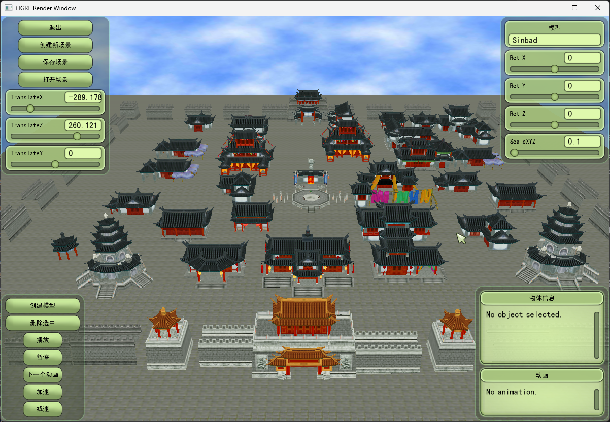
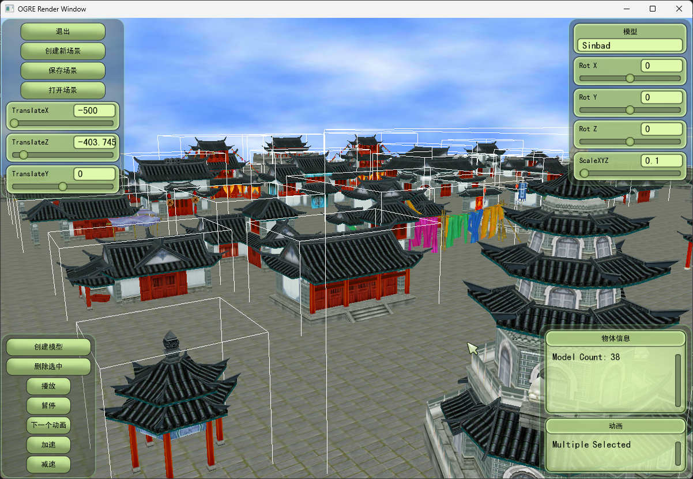
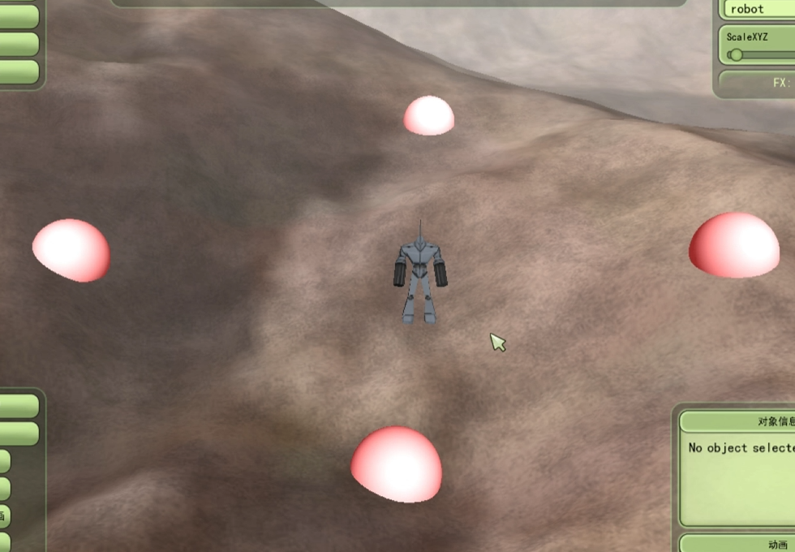
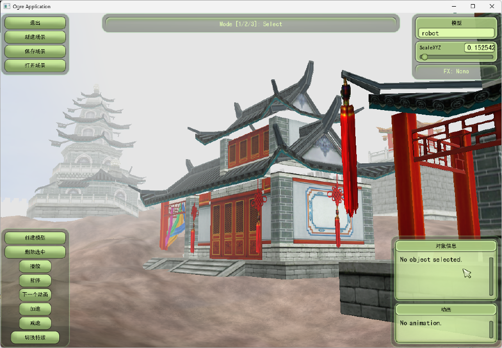
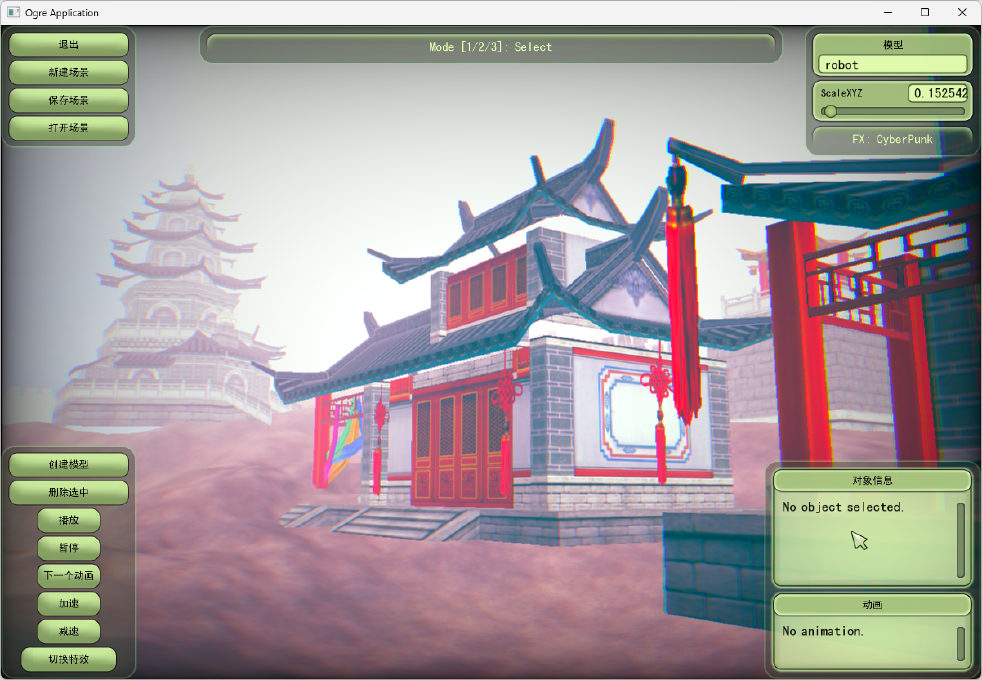

# 🎨 3D关卡编辑器与漫游系统

> 基于 Ogre 1.7 引擎配置与实现的轻量级 3D 关卡编辑与漫游框架，涵盖引擎运行生命周期配置、高精度空间交互、状态机驱动 of 寻路逻辑及自定义屏幕后处理特效，实现了功能完整的 3D 逻辑交互程序。

## 📋 技术栈

**C++** | **Ogre 1.7** | **HLSL** | **JSON** | **OIS**

***

## 🌟 核心功能

### 场景编辑系统

- 高度图地形加载与环境渲染
- 实时场景搭建与多选编辑
- 场景持久化（JSON 导出/导入）

### 角色漫游系统

- 多目标选取
- 平滑转向与动画混合
- 状态机管理

### 视觉特效系统

- 自定义 HLSL 屏幕后期特效

***

## 💡 技术亮点

### 1. 引擎生命周期与帧监听管理

- 基于 Ogre::Root 进行上下文配置，统一窗口绑定、资源管理（resources_d.cfg）与相机视口关联
- 重写 FrameListener 帧监听接口，接管键盘鼠标输入、UI 刷新与逐帧状态更新逻辑

### 2. 高精度场景拾取与交互

- **精准射线单选**：基于 RaySceneQuery 实现 3D 空间精准点选，支持地形高度探测与对象拖拽
- **视锥体框选**：利用屏幕坐标计算并构建 PlaneBoundedVolume，实现 RTS 风格多目标拖拽框选

### 3. 角色路点漫游

- **全局路点系统**：使用 std::deque<Vector3> 存储空间路点队列
- **平滑转向计算**：通过向量点乘与四元数插值实现平滑旋转，处理 180 度调头等旋转奇异值边界情况
- **动画权重管理**：深入 Ogre 动画状态机，实现 Idle 与 Walk 动画淡入淡出无缝混合

### 4. 自定义屏幕后处理特效

- 编写 HLSL 着色器，在 GPU 端对 R/B 通道的 UV 采样进行坐标偏移，实现边缘色差分离效果（Chromatic Aberration）
- 基于明度（Luminance）将画面色彩映射至霓虹青与霓虹粉双色调，配合平滑多项式暗角（Vignette）边缘衰减，提升画面品质
- 结合 .material 和 .compositor 脚本实现后处理渲染管线

### 5. 场景数据序列化与持久化

- 场景实体位置、缩放、旋转（四元数转欧拉角）序列化导出为 JSON
- 支持场景资源的一键安全卸载与基于配置文件 JSON 反序列化加载

***

## 🔧 技术难点与解决方案

### 1. 地形误选拦截

- **问题**：Ogre 1.7 地形切片默认掩码 0xFFFFFFFF 穿透 setQueryMask
- **解决**：双重过滤机制，自定义 QUERY_MASK_USER_MODEL 位掩码 + 名称前缀强拦截

### 2. 内存泄漏治理与野指针防护

- **问题**：多选切换与场景重置时，`std::vector`挂载的裸指针极易引发访问越界与内存泄漏
- **解决**：重构 `DestroySceneNode` 核心析构函数。采用 `while` 循环深度优先释放子节点，在物理销毁前强制置空所有强依赖该内存的 UI/业务层指针

### 3. 复杂交互态下的逻辑解耦

- **问题**：在"框选->下达寻路指令->中途换人选中"的复杂流转中，数据容易串联污染
- **解决**：抽象出 `syncSelectedToWalking()` 同步层，将"寻路数据池（路点集合）"与"执行器（实体模型）"彻底解耦，完美支撑"先绘制路线，再动态指派模型"的高级交互模式。

***

## 📷 项目展示

### 场景编辑界面

| 古风场景搭建                            | 多选编辑功能                                |
| --------------------------------- | ------------------------------------- |
|  |  |
| *模型加载与环境渲染效果*                     | *多目标拖拽框选*                             |

### 角色漫游效果

*💡 点击跳转视频*

### 后期特效展示

| 原始效果                                  | 后处理特效                                  |
| ------------------------------------- | ------------------------------------- |
|  |  |
| *未应用后处理*                              | *应用色差与赛博双色调滤镜效果*                     |

***

## 🎯 技术沉淀与总结

- **引擎生命周期掌握**：理解 3D 引擎初始化配置、视口摄像机绑定等生命周期流程
- **后处理特效开发**：独立编写 HLSL 像素着色器，实践通道偏移与色彩映射后处理效果
- **内存管理能力**：解决内存泄漏和野指针问题，提升 C++ 堆内存管理能力
- **系统模块解耦**：设计状态机与帧监听监听系统，锻炼模块化与解耦的软件开发能力
